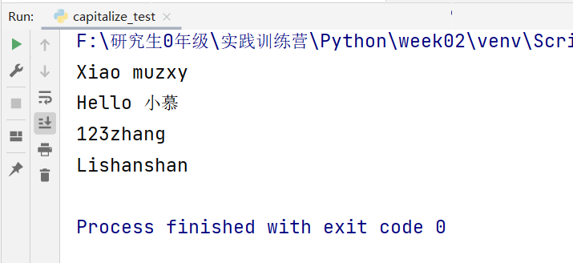
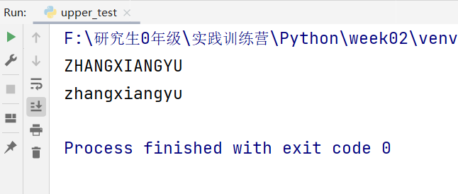
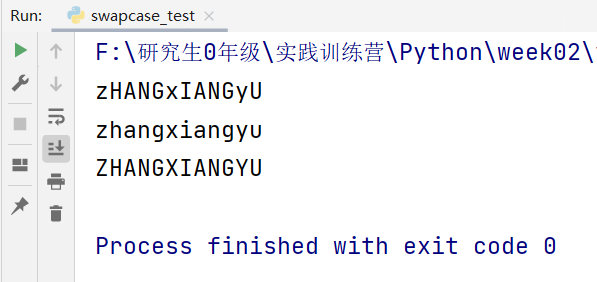
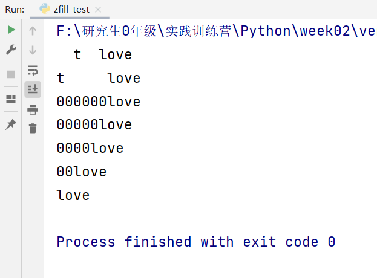
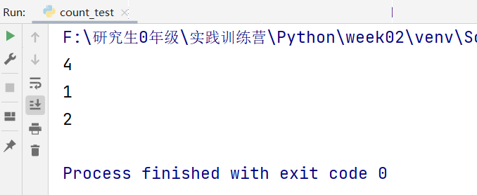
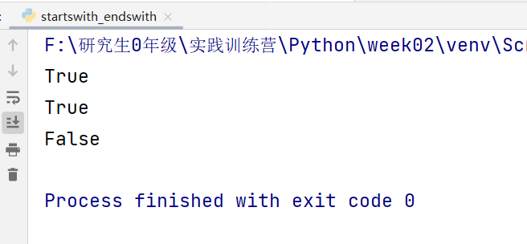
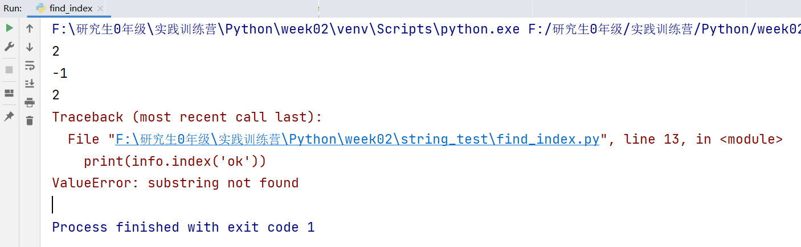

# week02-summary

## 一、字符串

### 1.capitalize()

如果字符串中首个字符是小写字母的话，会将其转化成大写字母。后面不是首字符的大写字母会将其转化成小写字母。

如果字符串中首个字符是大写字母的话，不对首字母做处理。后面不是首字符的大写字母会将其转化成小写字母。

如果字符串中首个字符是中文或者数字的话，也不对其做处理。后面不是首字符的大写字母会将其转化成小写字母。

```python
# coding:utf-8

name1 = 'xiao MUZXY'
name2 = 'hello 小慕'
name3 = '123zhAng'
name4 = 'LiShanShan'

new_name1 = name1.capitalize()
new_name2 = name2.capitalize()
new_name3 = name3.capitalize()
new_name4 = name4.capitalize()

print(new_name1)
print(new_name2)
print(new_name3)
print(new_name4)
```




### 2.lower()	

将字符串中的全部大写字母转化成小写字母

### 3.upper()

将字符串中的全部小写字母转化成大写字母

```python
# coding:utf-8

name = 'ZhangXiangYu'
# 将字符串中的小写字母全部转化成大写
big_name = name.upper()
# 将字符串中的大写字母全部转化成小写
small_name =name.lower()

print(big_name)
print(small_name)
```




### 4.swapcase()

将指定字符串中大写字母转化成小写，将小写字母转化成大写

```python
# coding:utf-8
"""
swapcase函数是将字符串中的大写字母转化成小写字母
将小写字母转化成大写字母
"""


info_one = 'ZhangXiangYu'
# 在这里等价于lower函数
info_two = 'ZHANGXIANGYU'
# 这里等价于upper函数
info_three = 'zhangxiangyu'

info_one_new = info_one.swapcase()
info_two_new = info_two.swapcase()
info_three_new = info_three.swapcase()

print(info_one_new)
print(info_two_new)
print(info_three_new)
```



### 5.zfill()

括号里面填入参数，参数如果大于本身字符串的长度时，前面用0补齐。如果小于等于字符串的长度时，不进行操作。

```python
# coding:utf-8

heart = 'love'

if __name__ == '__main__':
    print('  t  '+heart)
    print('t     '+heart)
    print(heart.zfill(10))
    print(heart.zfill(9))
    print(heart.zfill(8))
    print(heart.zfill(6))
    print(heart.zfill(4))
```



### 6.count()

括号里面填写参数（字符），统计字符串中参数出现的次数

```python
# coding:utf-8

name = 'zhangxiangyu  lishanshan'

a = name.count('a')  # 4
z = name.count('z')  # 1
i = name.count('i')  # 2

print(a)
print(z)
print(i)
```



### 7.startwith()和endswith()

startwith()判断该字符串是否以参数字符串开头，是则返回True，否则返回False

endswith()判断该字符串是否以参数字符串结尾，是则返回True，否则返回False

```python
# coding:utf-8

name = 'My name is zhangxiangyu'
print(name.startswith('My'))
print(name.endswith('yu'))
print(name.endswith('123'))
```



### 8.find()和index()

find()正如其名字一样——寻找！在该字符串中寻找参数（子串）所在的位置；如果找到子串，则返回子串在原串中的首字母位置。**如果没找到则返回-1**

index()正如其名字一样——索引！在该字符串中寻找参数（子串）所在的位置；如果找到子串，返回子串在原串中的首字母位置。**如果没有找到则程序会报错！**

```python
# coding:utf-8

info = 'zhangxiangyu'
# find的使用
# 在字符串中能找到子串，返回子串所在原串中的首字母索引（从0开始）
# 没有找到，返回-1
print(info.find('an'))
print(info.find('ok'))


# index的使用
# 在原字符串中寻找子串所在的索引位置，找到之后返回
# 如果在原字符串中找不到，就会报错
print(info.index('an'))
print(info.index('ok'))
```



